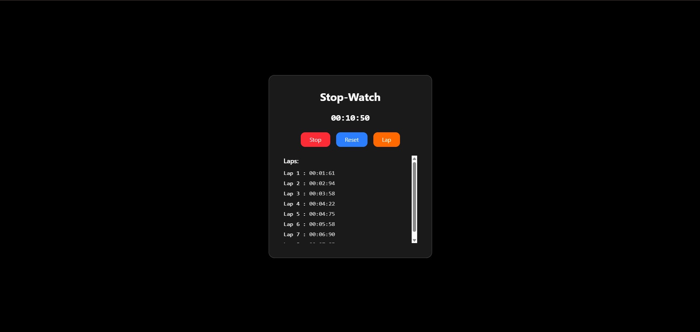

# StopWatch

Another UseRef Practice Project that creates a StopWatch with Lap Feature as well.

---

## Demo / Preview

<!-- Add a screenshot, video, or link to live demo -->
  
---

## Features

- Lap Function
- Simple Usage of Hooks

---

## Tech Stack

**Client:** React / Tailwindcss

---

### Prerequisites

- Node.js 

### Installation

```bash
# Clone the repository
git clone https://github.com/adityakalra007/StopWatch.git

# Move into the project folder
cd StopWatch

# Install dependencies
npm install

# Start the project
npm run dev

